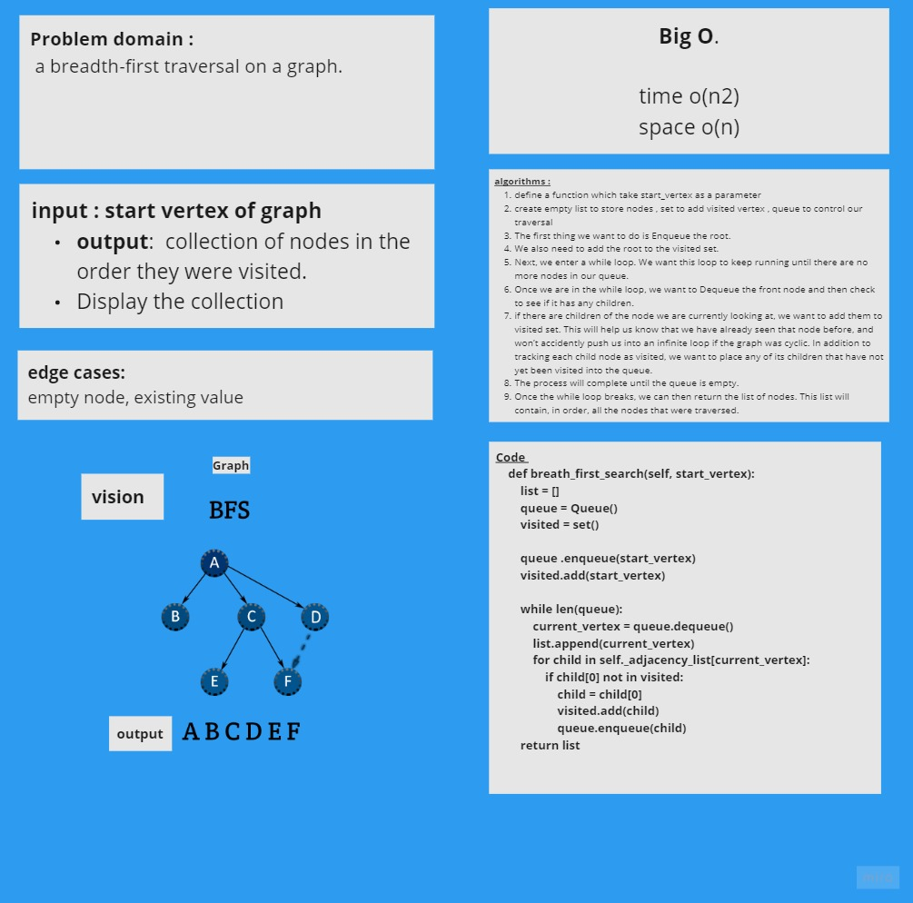

# Challenge Summary
<!-- Description of the challenge -->
 Implement a breadth-first traversal on a graph.

## Whiteboard Process
<!-- Embedded whiteboard image -->

## Approach & Efficiency
In a breadth first traversal, I starting at a specific vertex/node. This node must be specified when calling the BreadthFirst() method.

 The breadth-first traversal of a graph is like that of a tree, with the exception that graphs can have cycles. 
 
 Traversing a graph that has cycles will result in an infinite loop….this is bad. To prevent such behavior, we need to have some way to keep track of whether a vertex has been “visited” before. Upon each visit, we’ll add the previously-unvisited vertex to a visited set, so we know not to visit it again as traversal continues.
<!-- What approach did you take? Why? What is the Big O space/time for this approach? -->

## Solution
<!-- Show how to run your code, and examples of it in action -->

The visual above shows the levels in which the nodes will be added to the queue. we can see that since the root node is A, it will look the nodes that are only 1 away from the root. This is C,E, & B.

Next it will look at the nodes that are 2 away from the root, this is F, G, & D. It will follow this pattern until it reaches the end of the graph and all nodes have been visited.

[code](graph_breadth_first.py)
