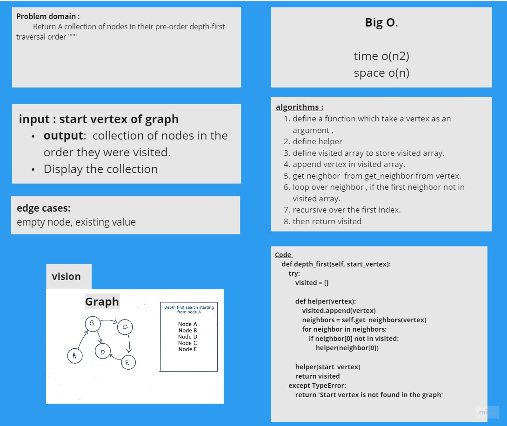

# Challenge Summary
<!-- Description of the challenge -->
 Implement a depth-first traversal on a graph.

## Approach & Efficiency

Time complexity:
  o(n)2

space o(n)
## Solution
<!-- Show how to run your code, and examples of it in action -->

Output: [A, B, C, G, D, E, H]