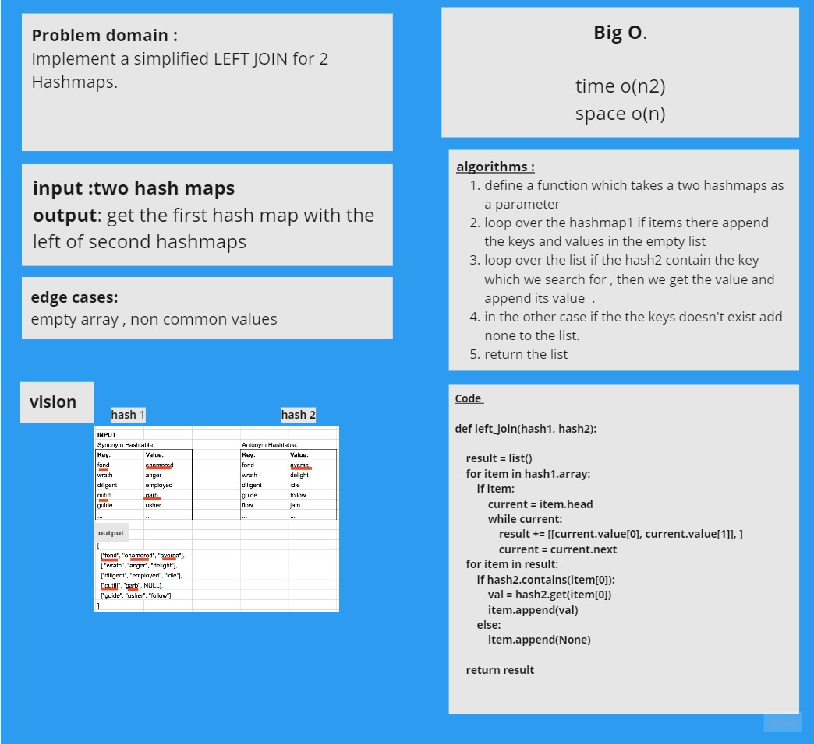

# Hashmap LEFT JOIN
<!-- Short summary or background information -->

## Challenge
<!-- Description of the challenge -->
Implement a simplified LEFT JOIN for 2 Hashmaps.

## Approach & Efficiency
<!-- What approach did you take? Why? What is the Big O space/time for this approach? -->
The approach which I took is firslty get the first hashtable as list .
then I looped over it . then I check if the seconds hash table contain my key value ,  if yes add the value for this key in my list , else add None

## Solution
<!-- Embedded whiteboard image -->

[code](hashmap_left_join.py)
