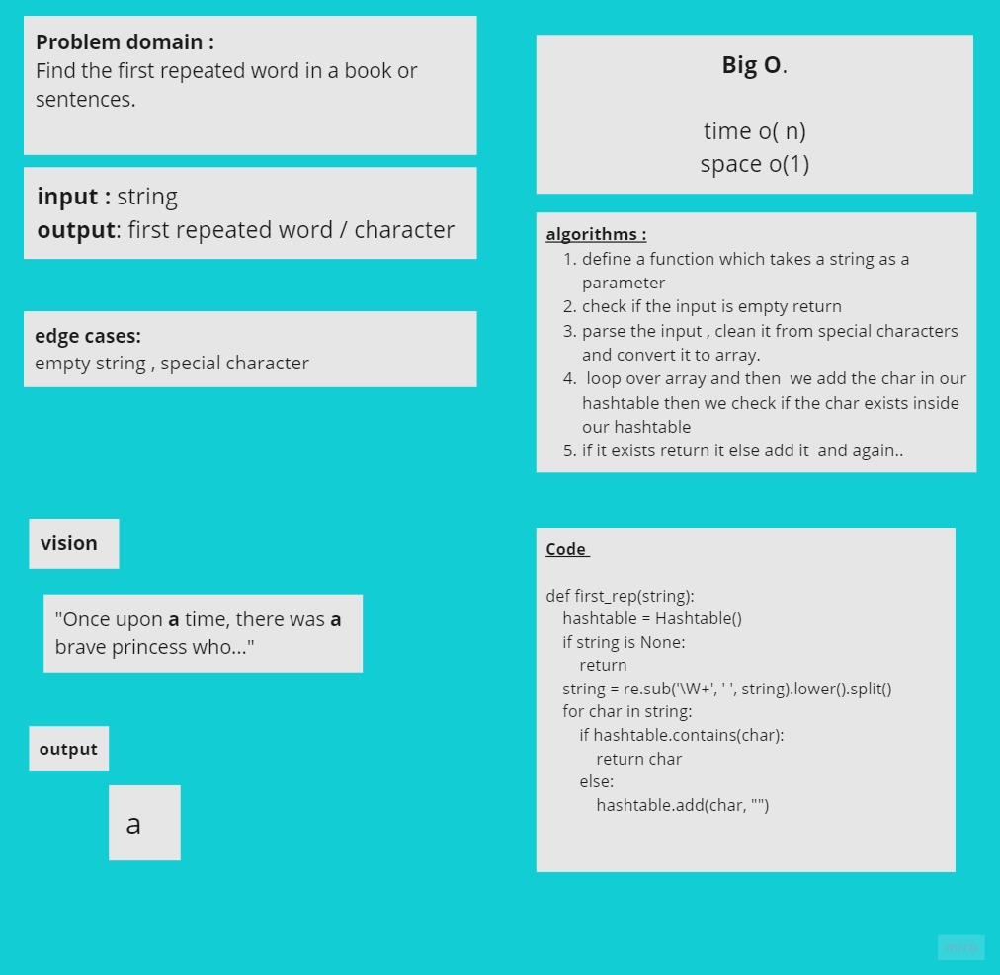

# Challenge Summary
<!-- Description of the challenge -->
Find the first repeated word in a book or sentences .

## Whiteboard Process
<!-- Embedded whiteboard image -->

## Approach & Efficiency
<!-- What approach did you take? Why? What is the Big O space/time for this approach? -->
The approach which I took is firstly to split the text or sentences , clean it from any special character . put then use split to put in inside an array , then loop over it and add it to my hashtable , the first value is exists return it

Time o (n)
space o(1)

## Solution
<!-- Show how to run your code, and examples of it in action -->

**input** :

"Once upon a time, there was a brave princess who..."

1. split it , convert it to lower case , clean it from any special character

['once', 'upon', 'a', 'time', 'there', 'was', 'a', 'brave', 'princess', 'who']

2. loop over it , add words in our hashtable , if the word exits return it

## code 