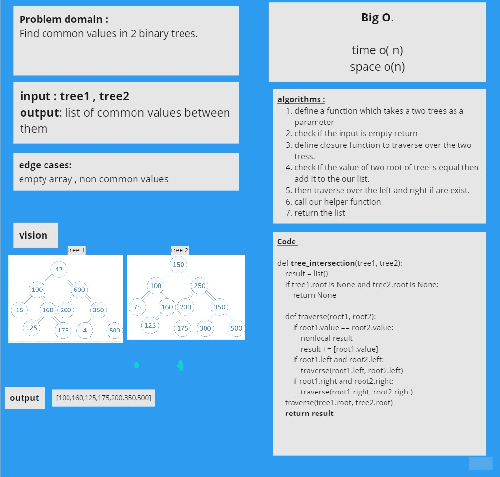
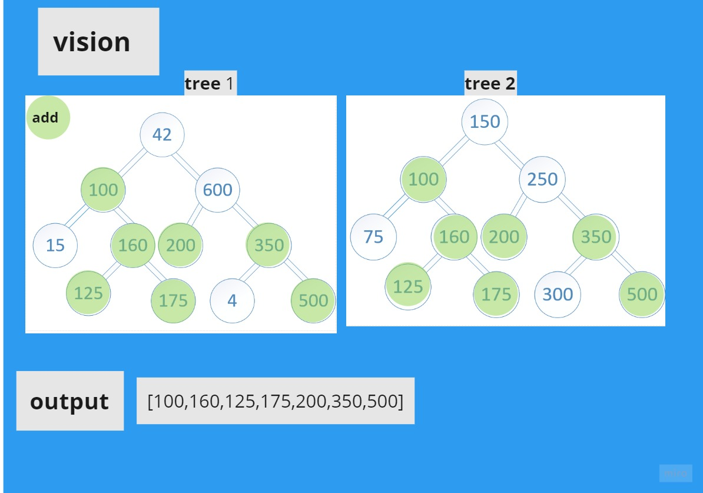

# Challenge Summary
<!-- Description of the challenge -->
Find common values in 2 binary trees.

## Whiteboard Process
<!-- Embedded whiteboard image -->

## Approach & Efficiency
<!-- What approach did you take? Why? What is the Big O space/time for this approach? -->
The approach which I took is traverse over the tree use depth first then append the common values.

Time o (n)
space o(n)

## Solution
<!-- Show how to run your code, and examples of it in action -->

[code](hashmap_tree_intersection.py) 
