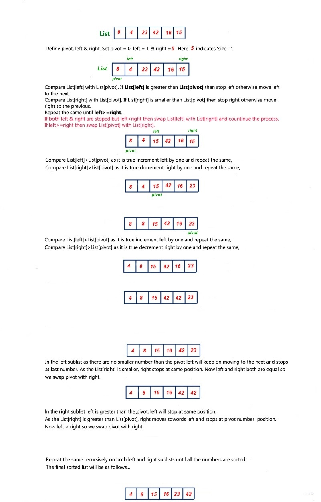

# Quick sort 

### The function which will go through it 


• sample array : 

arr= [8 , 4 , 23 , 42 , 16 , 15 ]

```

def quick_sort(array, left, right):
    if left < right:
        position = Partition(array, left, right)
        quick_sort(array, left, position - 1)
        quick_sort(array, position + 1, right)
    return array


def Partition(array, left, right):
    pivot = array[right]  # pick last element as pivot
    low = left - 1
    for i in range(left, right):
        if array[i] <= pivot:
            low += 1
            Swap(array, i, low)

    Swap(array, right, low + 1)
    return low + 1


def Swap(array, i, low):
    temp = array[i]
    array[i] = array[low]
    array[low] = temp


```

### Visualization and trace of code: 





********************************************
## Complexity of the Quick Sort Algorithm

To sort an unsorted list with 'n' number of elements, we need to make ((n-1)+(n-2)+(n-3)+......+1) = (n (n-1))/2 number of comparisions in the worst case. If the list is already sorted, then it requires 'n' number of comparisions.

Worst Case : O(n2)
Best Case : O (n log n)
Average Case : O (n log n)