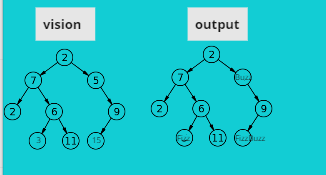

# Challenge Summary

<!-- Description of the challenge -->

Conduct “FizzBuzz” on a k-ary tree while traversing through it to create a new tree.
Set the values of each of the new nodes depending on the corresponding node value in the source tree.

## Whiteboard Process

<!-- Embedded whiteboard image -->

## Approach & Efficiency

define fizzBuzz function (KAryTree)
define traverse (node)

loop over the children then traverse(node.child[i])

if value node.child[i] % 5 and %3 = 0 , value = FizzBuzz

if value node.child[i] % 5 , value = Buzz
if value node.child[i] % 3 , value = fizz

else value node.child[i] % 3 , value = same value as string.

traverse (KAryTree.root)
then we repeat the steps for tree.root and return tree.

## Solution

here is an exapmle of last result after input the values and after use fizzBuzz.

<!-- Show how to run your code, and examples of it in action -->
