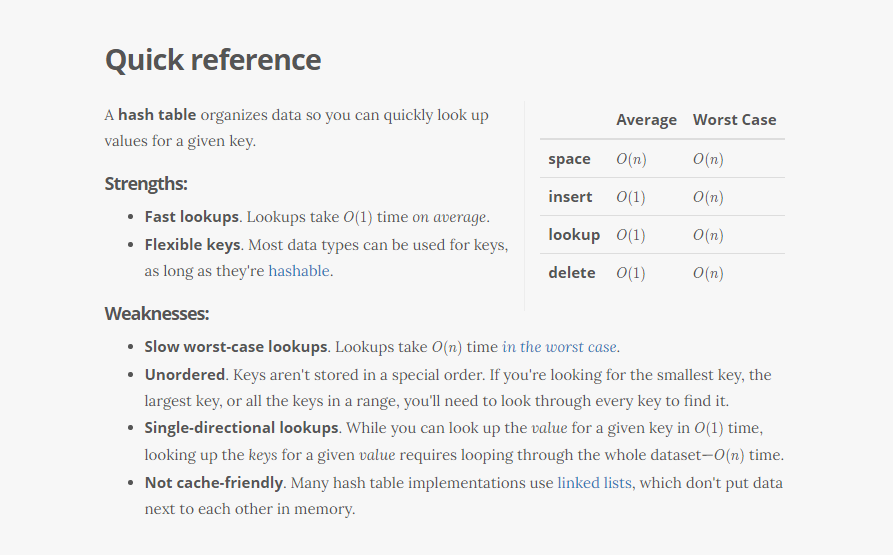

# Hashtables
<!-- Short summary or background information -->

***********************************

## Challenge
<!-- Description of the challenge -->
Challenge Type: New Implementation of Hashtable

### Features

**• add**

**• get**

**• contains**

**•hash**
***************************************************

## Approach & Efficiency
<!-- What approach did you take? Why? What is the Big O space/time for this approach? -->
create Hashtable class which contain of size of bucket which will store nodes 

 create linked list , to add values which have same sumAsci to prevent collsion.

add - > o(n) for the worst case

contain - >o(n) for the worst case

get  - >o(n) for the worst case

*************************************************	
## API
<!-- Description of each method publicly available in each of your hashtable -->

**• add**

Arguments: key, value

Returns: nothing

This method should hash the key, and add the key and value pair to the table, handling collisions as needed.

**• get**

Arguments: key

Returns: Value associated with that key in the table

**• contains**

Arguments: key

Returns: Boolean, indicating if the key exists in the table already.

**•hash**

Arguments: key

Returns: Index in the collection for that key